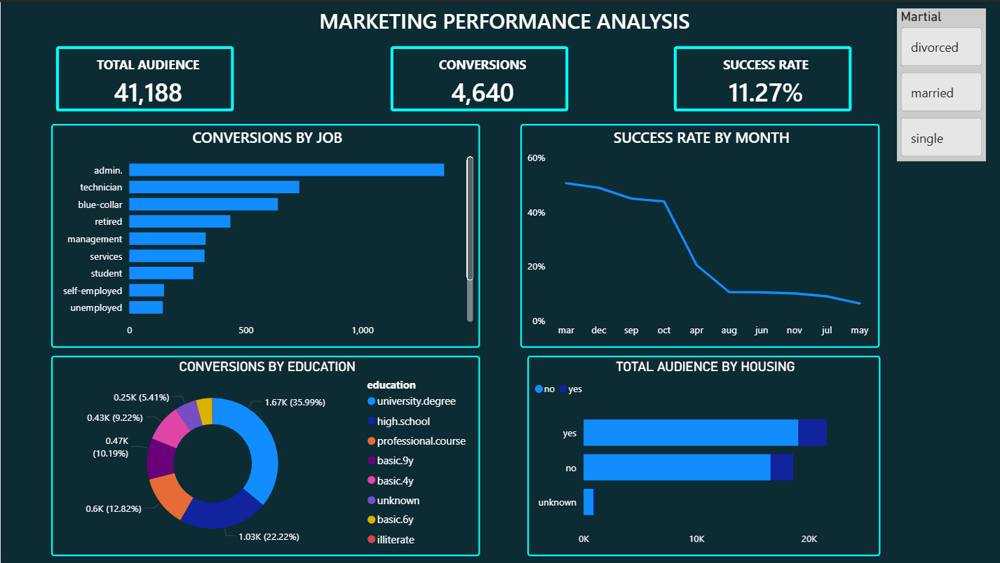

# 🚀 FUTURE_DS_03 – Marketing Funnel Analysis

A high-impact Power BI dashboard designed to analyze marketing campaign performance. This project transforms raw banking data into actionable insights using a modern "Cyberpunk" aesthetic.

## 📊 Dashboard Preview

## 🎯 Key Insights
- **Total Audience:** 41,188 records analyzed.
- **Conversions:** 4,640 successful marketing outcomes.
- **Success Rate:** A solid 11.27% conversion efficiency.
- **Demographics:** Deep dive into job types, education levels, and housing status.

## 🛠️ Tech Stack
- **Power BI:** Data Visualization & DAX Modeling.
- **Git/GitHub:** Version Control.
- **VS Code:** Documentation & Project Management.

## 📂 Project Structure
- `Task_3.pbix`: The source Power BI file.
- `bank-additional-full.csv`: The dataset used for analysis.
- `Marketing_Dashboard_Video.mp4`: A screen-recording of the interactive dashboard.